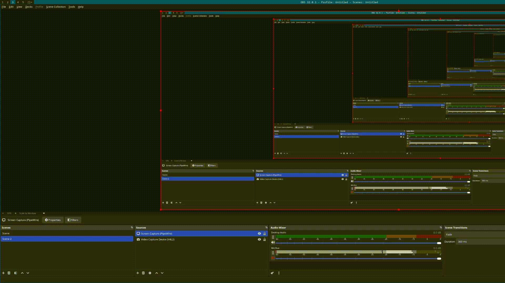
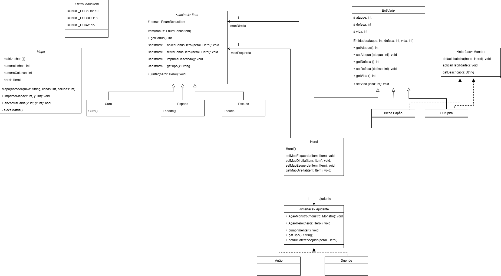

# joguinhobobo
joguinho bobo usa as melhores teorias de classes, solid e outras

```
mvn compile exec:java
```
[RUN_RECORDED](2025-10-08%2018-58-42.mp4)



```
#####################
# # #         #     #
# # # # ##### # # ###
# #   # #     # #   #
# ##### # ##### ### #
# #     #   #   # # #
# # ####### # ### # #
# #   #   # # #   # #
# ### # # # # ### # #
#     # # # #     # #
####### ### ####### #
# #       # #     # #
# # ##### # # ### # #
#   #     # #   #  ?#
# ### ##### ### ### #
#   #           #   =
#####################
```


```
LEDENDA:
#: Parede
8: Herói
?: Monstro Azul
*: Monstro Vermelho
/: Monstro Verde
^: Duende
&: Anão
e: Espada
d: Escudo
c: Cura
=: Saida
```

- Proxy dentro das factories para fazer o log

- Poderia ter criado uma única factory para cada entidade.
- Proxy muito acoplado com as classes Monstro, Item e Ajudante.
